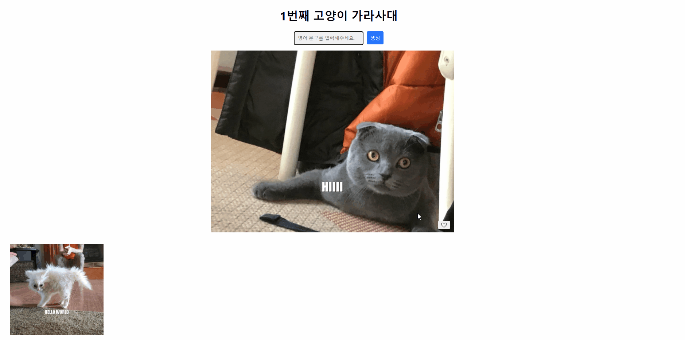

# My cat jjal maker

- useState를 통해 상태를 관리했습니다.
- 함수, 변수를 Props로 넘겨받아 사용했습니다.
- 인라인 스타일을 작성했습니다.
- fetch() 함수를 통해 API를 호출했습니다.
- 상태값을 localStorage에 저장해서 사용했습니다.
  - `JSON.parse()`, `JSON.stringify()` 메서드를 이용하여 데이터를 변환했습니다.
